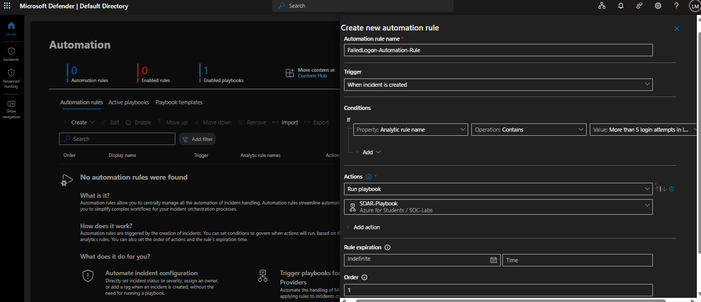

# 📌 Project Scenario

Detecting a threat is only the beginning.

Once a security incident has been identified, someone needs to review it, decide how serious it is, and begin responding. In a busy Security Operations Center (SOC), performing these tasks manually for every alert can quickly become repetitive and time-consuming.

This is where **Security Orchestration, Automation, and Response (SOAR)** becomes valuable.

In this lab, I extended the Microsoft Sentinel environment by introducing automated incident response. Whenever the Analytics Rule detected suspicious authentication activity and created an incident, Microsoft Sentinel automatically triggered an Azure Logic App (Playbook) that sent an email notification to the SOC analyst.

This demonstrates how repetitive response tasks can be automated, allowing analysts to respond to security incidents more efficiently and consistently.

---

# 🎯 Lab Objectives

The primary objectives of this lab were to:

- Create a Microsoft Sentinel Analytics Rule capable of detecting suspicious authentication activity.
- Develop a Logic App Playbook using the Microsoft Sentinel Incident Trigger.
- Configure automated response actions within the Playbook.
- Create a Microsoft Sentinel Automation Rule to execute the Playbook whenever an incident is created.
- Validate the complete incident response workflow from detection through automated notification.

---

# 🏗️ SOAR Architecture

The following diagram illustrates the automated response workflow implemented during this lab.

```text
                  Microsoft Sentinel
                  Security Incident
                          │
                          ▼
                 Automation Rule
                          │
                          ▼
             Logic App Playbook (SOAR)
                          │
                  Microsoft Sentinel
                  Incident Trigger
                          │
                          ▼
               Send Email (Outlook V2)
                          │
                          ▼
                 SOC Analyst Notification
```

This workflow executes automatically without requiring analyst intervention.

Once Microsoft Sentinel creates an incident, the Automation Rule immediately launches the Logic App Playbook, which performs the predefined response action.

---

## 🛠️ Technologies Used

| Technology | Purpose |
|------------|---------|
| Microsoft Sentinel | Detects suspicious activity and creates security incidents |
| Analytics Rules | Detect predefined attack patterns and generate incidents |
| Automation Rules | Automatically execute response actions when incidents occur |
| Azure Logic Apps | Orchestrate automated security response workflows |
| Microsoft Sentinel Incident Trigger | Starts the Logic App whenever an incident is created |
| Outlook Connector (Send Email V2) | Sends automated email notifications |
| Microsoft Azure | Hosts all cloud resources used throughout the lab |

---

## 🚨 Creating the Analytics Rule

## Analytics Rule

The Analytics Rule created during the SIEM phase acts as the starting point for the automation process.

Whenever the rule detects suspicious authentication activity that matches the configured conditions, Microsoft Sentinel automatically creates a security incident.

This incident becomes the trigger that starts the automated response workflow.


---

## 🚨 Security Incident Created

To test the automation, additional failed authentication attempts were generated against the honeypot virtual machine.

Once the Analytics Rule detected that the configured conditions had been met, Microsoft Sentinel automatically created a new security incident.

This confirmed that the detection logic was working correctly and that the incident was ready to be passed to the automated response workflow.


---

## ▶️ Creating the Playbook

With Microsoft Sentinel successfully creating incidents, the next step was to automate the response.

Microsoft Sentinel provides several Playbook templates depending on when the automation should run. Since the goal was to respond whenever a new incident was created, I selected the **Playbook with an Incident Trigger** template.

This template automatically starts the workflow whenever Microsoft Sentinel creates a qualifying incident, making it the ideal starting point for incident response automation.


---

## 🏗️ Creating the Logic App

After selecting the appropriate template, the Playbook was created as an Azure Logic App.

During this step, I configured the basic deployment settings, including the Azure subscription, resource group, region, and Playbook name.

Once these settings were configured, Azure deployed the Logic App and prepared it for the automation workflow that would be built in the following steps.

At this stage, the Playbook had been created but no response actions had been added yet.


---

## 🧩 Understanding the Logic App Designer

Once the Playbook was created, Azure opened the **Logic App Designer**.

This is where the automation workflow is built.

Because I selected the **Playbook with an Incident Trigger** template, Azure automatically added the **Microsoft Sentinel Incident Trigger** as the first step in the workflow.

You can think of this trigger as something that is constantly waiting. As soon as Microsoft Sentinel creates a new incident, it activates the Playbook and begins executing every action that follows.

At this stage, the workflow only contained the trigger. The next step was to define what action the Playbook should perform once it was triggered.


---

## ➕ Adding an Automated Response Action

With the trigger in place, the next step was deciding what should happen whenever a new incident was created.

Azure Logic Apps provides hundreds of built-in connectors that can interact with Microsoft services as well as third-party platforms. This allows organizations to automate a wide range of response actions depending on their requirements.

For this lab, I chose to add a **Send an Email (V2)** action using the Microsoft Outlook connector.

This demonstrates one of the key ideas behind SOAR: once an incident is detected, the response can begin automatically without waiting for someone to manually intervene.


---

## 📧 Configuring the Email Notification

After adding the Outlook connector, the next step was configuring the email that would be sent whenever the Playbook was triggered.

For this lab, I kept the email simple by adding a subject and a message informing the SOC analyst that Microsoft Sentinel had created a new security incident.

In a real-world environment, the email could also include dynamic information such as the incident name, severity, IP address, affected host, or the time the incident was created.

For this project, the main objective was to verify that the Playbook could successfully notify an analyst whenever a new incident was detected.


---

## 🔗 Outlook Connector Successfully Added

Once the email action was configured, it became part of the Logic App workflow.

The Playbook now consisted of two connected components:

1. Microsoft Sentinel Incident Trigger
2. Send Email (V2)

This completed the basic response workflow.

Whenever Microsoft Sentinel generates a qualifying incident, the trigger activates, the workflow executes automatically, and the configured email notification is sent to the SOC analyst.


---

## ✅ Playbook Completed

After configuring the email action, the Playbook was complete and ready to be used.

At this point, the workflow contained everything needed to respond automatically to new Microsoft Sentinel incidents. Whenever an incident is created, the Playbook will start, execute the configured actions, and send an email notification to the SOC analyst.

The next step was connecting this Playbook to Microsoft Sentinel using an Automation Rule.


---

## ⚙️ Creating the Automation Rule

With the Playbook ready, the final step was to connect it to Microsoft Sentinel.

This was done by creating an **Automation Rule**, which acts as the bridge between a security incident and the Playbook.

The Automation Rule was configured to trigger whenever a new incident was created. Once the trigger conditions were met, Microsoft Sentinel would automatically launch the Playbook without requiring any manual action from the analyst.

This completed the automation workflow by linking threat detection with automated response.



---

## ✅ Automation Rule Enabled

Once the Automation Rule was created and enabled, Microsoft Sentinel continuously monitored for new incidents that matched the configured trigger.

Whenever a qualifying incident was created, the Automation Rule automatically launched the Playbook, allowing the response process to begin immediately without any manual intervention.

With the automation now in place, the only thing left to do was generate another security incident and verify that the entire workflow operated as expected.


---

## 🧪 Testing the Automated Workflow

With the Automation Rule enabled, the final step was to test the complete workflow.

To do this, additional failed authentication attempts were generated against the honeypot virtual machine. Once the Analytics Rule detected the activity, Microsoft Sentinel automatically created a new security incident.

As soon as the incident was created, the Automation Rule triggered the Playbook exactly as configured, demonstrating that the detection and response workflow was functioning correctly from start to finish.ive monitoring to automated incident response.


---

## 📈 Reviewing the Playbook Run History

Azure Logic Apps keeps a record of every time a Playbook is executed.

After the security incident was created, the Playbook automatically started and completed all of its configured actions successfully.

The **Run History** confirms that the Automation Rule successfully triggered the Playbook and that the workflow executed without any errors.

This provides clear evidence that the automated response process was working as expected.


---

## 📧 Verifying the Email Notification

The final step in the workflow was the successful delivery of the email notification.

Receiving the email confirmed that the Playbook had executed successfully after Microsoft Sentinel created the security incident.

This completed the end-to-end automation process:

- Suspicious authentication activity was detected.
- Microsoft Sentinel created a security incident.
- The Automation Rule automatically triggered the Playbook.
- The Playbook executed the configured actions.
- An email notification was sent to the SOC analyst.

This demonstrates how Microsoft Sentinel and Azure Logic Apps can work together to automate incident response, reducing manual effort and enabling security analysts to respond more quickly to potential threats.


---

# 🔄 End-to-End Security Workflow

At the completion of this project, the environment was capable of automatically detecting and responding to suspicious authentication activity.

The following workflow summarizes the complete security process implemented throughout both the SIEM and SOAR phases of this project.

```text
      Internet
        │
        ▼
Failed RDP Login Attempts
        │
        ▼
Windows Server Honeypot
        │
        ▼
Windows Security Events
        │
        ▼
Azure Monitor Agent (AMA)
        │
        ▼
Log Analytics Workspace
        │
        ▼
Microsoft Sentinel
        │
        ▼
Analytics Rule Detection
        │
        ▼
Security Incident Created
        │
        ▼
 Automation Rule
        │
        ▼
Logic App Playbook
        │
        ▼
Send Email (Outlook V2)
        │
        ▼
SOC Analyst Notification
```

Rather than simply collecting logs and displaying alerts, the environment is now capable of automatically responding whenever suspicious activity is detected.

This represents the complete lifecycle of a modern cloud-based Security Operations Center workflow—from log collection and threat detection to automated incident response.

---

# 💡 What I Learned

Before completing this phase of the project, I understood Microsoft Sentinel primarily as a platform for collecting logs and investigating security events.

Building the SOAR environment helped me understand that detection is only one part of the incident response process.

I learned how Microsoft Sentinel works together with Azure Logic Apps to automate repetitive security tasks, reducing the time between detection and response.

Rather than viewing Analytics Rules, Incidents, Automation Rules, and Playbooks as separate features, I now understand how they work together to create an automated response pipeline.

I also gained practical experience configuring Logic Apps, creating Automation Rules, and validating automated workflows through Playbook Run History.

This project reinforced the importance of automation within modern Security Operations Centers, where reducing response time can significantly improve an organization's ability to investigate and respond to security incidents.

---

# 🏁 Conclusion

This project demonstrates the complete lifecycle of a cloud-native Security Operations Center (SOC) using Microsoft Azure.

In the first phase, Microsoft Sentinel was configured as a SIEM solution to collect Windows Security Events, detect suspicious authentication activity, investigate logs using Kusto Query Language (KQL), enrich data with a GeoIP Watchlist, and visualize attack activity through a Workbook dashboard.

In the second phase, the environment was extended with SOAR capabilities. An Analytics Rule generated security incidents whenever suspicious activity was detected, while an Automation Rule automatically triggered an Azure Logic App (Playbook) that sent an email notification to the SOC analyst.

Although this lab used a simple email notification as the automated response, the same workflow could easily be expanded to perform more advanced actions, such as creating IT service tickets, notifying Microsoft Teams, isolating compromised devices, disabling user accounts, or integrating with other security platforms.

Overall, this project provided practical, hands-on experience with Microsoft Sentinel, Azure Monitor, Log Analytics Workspace, Kusto Query Language (KQL), Analytics Rules, Automation Rules, Azure Logic Apps, and automated incident response.

More importantly, it demonstrated how these Azure services work together to move from **threat detection** to **automated response**, creating a complete end-to-end SOC workflow.

---

➡️ **[See SOAR Architecture](../SOAR-Architecture/Part2-SIEM-Architecture.png)**

➡️ **Return to the main project:** [Azure SIEM & SOAR Lab](../README.md)


➡️ **View the complete SIEM + SOAR Architecture:** [Combined Architecture](../Architecture/SIEM-SOAR-Architecture.png)
