# 📌 Project Scenario

Detecting a threat is only the beginning.

Once a security incident has been identified, someone needs to review it, decide how serious it is, and begin responding. In a busy Security Operations Center (SOC), performing these tasks manually for every alert can quickly become repetitive and time-consuming.

This is where **Security Orchestration, Automation, and Response (SOAR)** becomes valuable.

In this lab, I extended the Microsoft Sentinel environment by introducing automated incident response. Whenever the Analytics Rule detected suspicious authentication activity and created an incident, Microsoft Sentinel automatically triggered an Azure Logic App (Playbook) that sent an email notification to the SOC analyst.

This demonstrates how repetitive response tasks can be automated, allowing analysts to respond to security incidents more efficiently and consistently.

---

# 🎯 Lab Objectives

The primary objectives of this lab were to:

- Create a Microsoft Sentinel Analytics Rule capable of detecting suspicious authentication activity.
- Develop a Logic App Playbook using the Microsoft Sentinel Incident Trigger.
- Configure automated response actions within the Playbook.
- Create a Microsoft Sentinel Automation Rule to execute the Playbook whenever an incident is created.
- Validate the complete incident response workflow from detection through automated notification.

---

# 🏗️ SOAR Architecture

The following diagram illustrates the automated response workflow implemented during this lab.

```text
                  Microsoft Sentinel
                  Security Incident
                          │
                          ▼
                 Automation Rule
                          │
                          ▼
             Logic App Playbook (SOAR)
                          │
                  Microsoft Sentinel
                  Incident Trigger
                          │
                          ▼
               Send Email (Outlook V2)
                          │
                          ▼
                 SOC Analyst Notification
```

Unlike manual incident response, this workflow executes automatically without requiring analyst intervention.

Once Microsoft Sentinel creates an incident, the Automation Rule immediately launches the Logic App Playbook, which performs the predefined response action.

---

## 🛠️ Technologies Used

| Technology | Purpose |
|------------|---------|
| Microsoft Sentinel | Detects suspicious activity and creates security incidents |
| Analytics Rules | Detect predefined attack patterns and generate incidents |
| Automation Rules | Automatically execute response actions when incidents occur |
| Azure Logic Apps | Orchestrate automated security response workflows |
| Microsoft Sentinel Incident Trigger | Starts the Logic App whenever an incident is created |
| Outlook Connector (Send Email V2) | Sends automated email notifications |
| Microsoft Azure | Hosts all cloud resources used throughout the lab |

---

# 🤖 From Detection to Response

At the end of Part 1, Microsoft Sentinel was successfully detecting suspicious authentication activity and creating security incidents.

While this demonstrates the core functionality of a SIEM platform, it also raises an important question:

> **What happens after an incident is created?**

Creating an incident alone does not stop an attack.

Someone still needs to review the alert, determine its importance, notify the appropriate people, and begin the investigation.

For a small number of incidents, these tasks can be completed manually. However, modern Security Operations Centers often process hundreds or even thousands of alerts every day.

Performing repetitive actions manually for every incident not only consumes valuable time but also increases the likelihood of delays and human error.

Microsoft Sentinel addresses this challenge through **Security Orchestration, Automation, and Response (SOAR).**

SOAR enables organizations to automate routine response activities by combining Microsoft Sentinel with **Automation Rules** and **Azure Logic Apps**.

Instead of waiting for an analyst to notice a newly created incident, Microsoft Sentinel can immediately execute a predefined workflow whenever specific detection criteria are met.

In this project, that automated workflow consists of:

- Detecting multiple failed RDP authentication attempts.
- Creating a Microsoft Sentinel incident.
- Automatically triggering a Logic App Playbook.
- Sending an email notification to the SOC analyst.

This creates a complete security workflow that extends beyond detection into automated response.

---

# 🚨 Creating the Analytics Rule

Everything within the SOAR workflow begins with an **Analytics Rule**.

Analytics Rules continuously monitor incoming log data and compare it against predefined detection logic.

When the specified conditions are satisfied, Microsoft Sentinel automatically generates a security incident.

For this project, I reused the custom Analytics Rule developed during the SIEM implementation.

The rule monitors Windows Security Events for repeated failed Remote Desktop authentication attempts (Event ID **4625**), which are commonly associated with brute-force attacks and password spraying.

Rather than requiring an analyst to manually monitor authentication logs, Microsoft Sentinel continuously evaluates incoming events and automatically creates an incident whenever the configured detection threshold is exceeded.

This incident becomes the starting point for the automated response workflow implemented throughout the remainder of this lab.

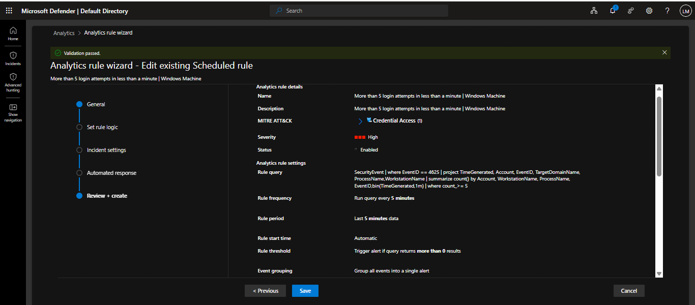

---

# 🚨 Security Incident Created

After deploying the Analytics Rule, I generated multiple failed Remote Desktop login attempts against the honeypot virtual machine.

Once the detection threshold configured within the Analytics Rule was reached, Microsoft Sentinel automatically created a new security incident.

Unlike the individual Windows Security Events examined during Part 1, an incident represents a higher-level security event that groups together related alerts requiring investigation.

Incidents provide analysts with a centralized location for reviewing suspicious activity, assigning ownership, tracking investigation progress, and coordinating response actions.

More importantly for this phase of the project, every newly created incident can also serve as the trigger for automated response workflows.

This capability allows Microsoft Sentinel to move beyond simply detecting threats and begin responding to them automatically.

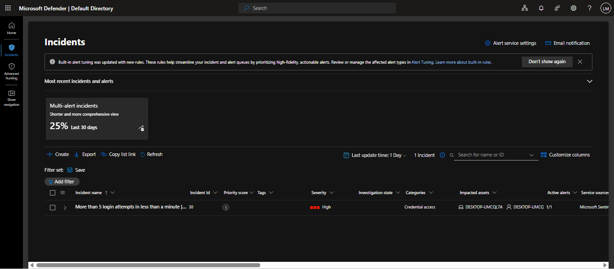

---

# ⚙️ Building the Logic App Playbook

With Microsoft Sentinel successfully generating security incidents, the next step was to automate the response.

While an analyst could manually monitor the Incidents page and react whenever a new alert appeared, Microsoft Sentinel also provides the ability to respond automatically using **Playbooks**.

A Playbook is an automated workflow built using **Azure Logic Apps**. It allows Microsoft Sentinel to perform predefined actions whenever specific security events occur.

Depending on the organization's requirements, a Playbook can perform a wide range of tasks, including:

- Sending email or Microsoft Teams notifications
- Creating IT service tickets
- Enriching incidents with threat intelligence
- Assigning incidents to analysts
- Blocking malicious IP addresses
- Disabling compromised user accounts
- Isolating infected endpoints through Microsoft Defender

For this project, the Playbook was configured to automatically send an email notification whenever Microsoft Sentinel created a new security incident.

Although simple, this demonstrates the fundamental principles of Security Orchestration, Automation, and Response (SOAR), allowing repetitive response tasks to be performed automatically.

---

## ▶️ Creating the Playbook

Microsoft Sentinel provides several Playbook templates depending on when the automation should execute.

Since the goal of this project was to automate actions after Microsoft Sentinel created a security incident, I selected the **Playbook with Incident Trigger** template.

Unlike an Alert Trigger, which executes when an alert is generated, the Incident Trigger activates only after Microsoft Sentinel has created an incident.

This makes it the ideal starting point for incident response workflows because the security event has already been detected, grouped, and classified by Microsoft Sentinel.

Selecting the correct trigger ensures that every qualifying incident can automatically launch the Logic App without requiring any manual interaction.


---

## 🏗️ Creating the Logic App

After selecting the appropriate template, the Logic App Playbook was created within Azure.

During deployment, several configuration options were specified, including:

- Azure Subscription
- Resource Group
- Region
- Playbook Name
- Log Analytics Workspace

These settings determine where the Logic App is deployed and how it integrates with the existing Microsoft Sentinel environment.

Once deployed, Azure automatically provisions the Logic App infrastructure that will later execute the automated response workflow.

Unlike traditional scripts that must be hosted and maintained manually, Azure Logic Apps provide a fully managed automation platform capable of integrating with hundreds of Microsoft and third-party services.

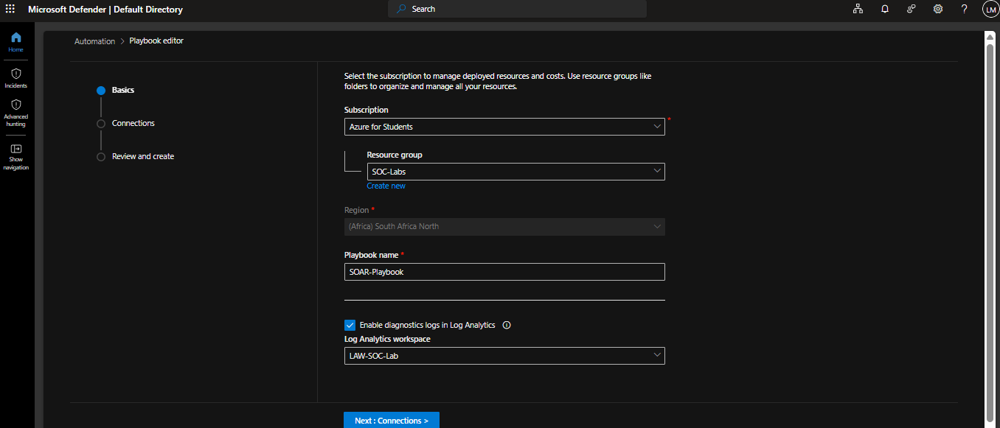

---

## 🧩 Understanding the Logic App Designer

Once deployment completed, Azure opened the **Logic App Designer**.

The Logic App Designer provides a visual interface for building automated workflows.

Instead of writing code, workflows are created by connecting individual actions together, allowing complex automation processes to be designed using a graphical interface.

Because the **Playbook with Incident Trigger** template was selected, Azure automatically added the **Microsoft Sentinel Incident Trigger** as the first component within the workflow.

This trigger continuously waits for Microsoft Sentinel to create a new incident.

Whenever a qualifying incident is generated, the trigger activates and begins executing every action that follows within the Playbook.

At this stage, the workflow contained only the trigger, ready for additional automated response actions to be added.

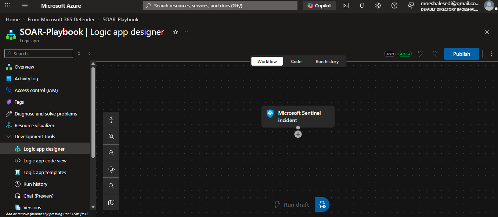

---

## ➕ Adding an Automated Response Action

With the trigger successfully configured, the next step was defining how the Playbook should respond whenever it received a new incident.

Azure Logic Apps includes hundreds of built-in connectors that allow workflows to interact with Microsoft services as well as third-party platforms.

Some commonly used security automation actions include:

- Sending email notifications
- Posting messages to Microsoft Teams
- Creating ServiceNow incidents
- Executing Azure Functions
- Querying threat intelligence platforms
- Updating Microsoft Sentinel incidents

For this lab, I selected **Send an email (V2)** using the Microsoft Outlook connector.

This action allows the Playbook to automatically notify the SOC analyst whenever Microsoft Sentinel creates a new security incident.

Adding this action transforms the workflow from simply detecting incidents into actively responding to them.

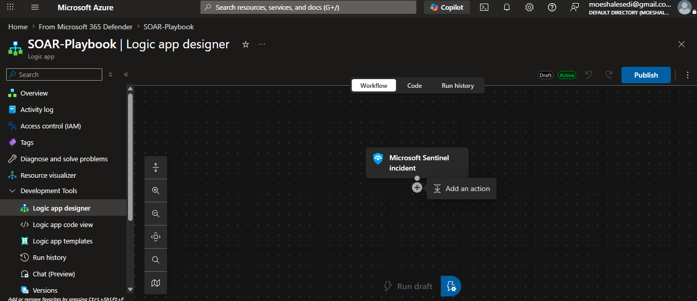

---

## 📧 Configuring the Email Notification

After selecting the Outlook connector, the email action was configured with the required information.

The notification includes a subject and message informing the recipient that Microsoft Sentinel has detected suspicious activity and created a new incident.

Although the email used in this project contains a simple notification message, Logic Apps also supports **Dynamic Content**.

Dynamic Content allows information from the incident itself—such as the incident title, severity, description, owner, or timestamp—to be automatically inserted into the email.

This enables organizations to deliver rich incident notifications containing detailed investigation information without requiring analysts to manually compile it.

For demonstration purposes, a simplified notification was used to verify that the Playbook executed successfully.

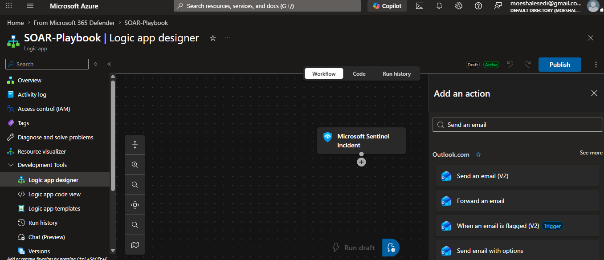

---

## 🔗 Outlook Connector Successfully Added

Once the email action was configured, it became part of the Logic App workflow.

The Playbook now consisted of two connected components:

1. Microsoft Sentinel Incident Trigger
2. Send Email (V2)

This completed the basic response workflow.

Whenever Microsoft Sentinel generates a qualifying incident, the trigger activates, the workflow executes automatically, and the configured email notification is sent to the SOC analyst.

Even though this Playbook performs only a single action, it demonstrates how Azure Logic Apps orchestrate security automation through a sequence of connected tasks.

Additional actions could easily be added later to create more advanced automated response workflows.

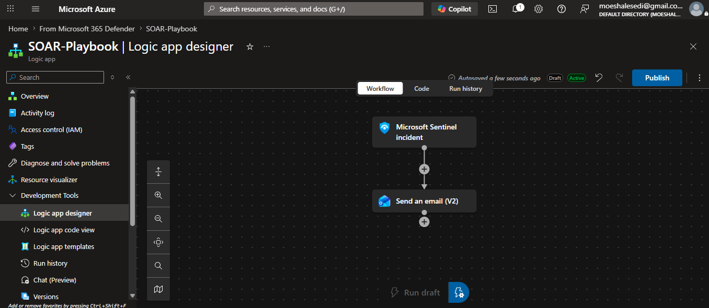

---

## ✅ Playbook Completed

After configuring the workflow, the Logic App Playbook was successfully published.

The completed Playbook now contains:

- Microsoft Sentinel Incident Trigger
- Outlook Send Email (V2) Action

At this stage, the Playbook was fully functional and capable of executing automatically whenever it received a security incident from Microsoft Sentinel.

However, simply creating the Playbook does not cause it to run automatically.

Microsoft Sentinel still needs a mechanism to determine **when** the Playbook should execute.

This is achieved through an **Automation Rule**, which links newly created incidents to the Logic App Playbook and launches the workflow whenever the specified conditions are met.

The next section focuses on creating that Automation Rule and completing the automated incident response process.

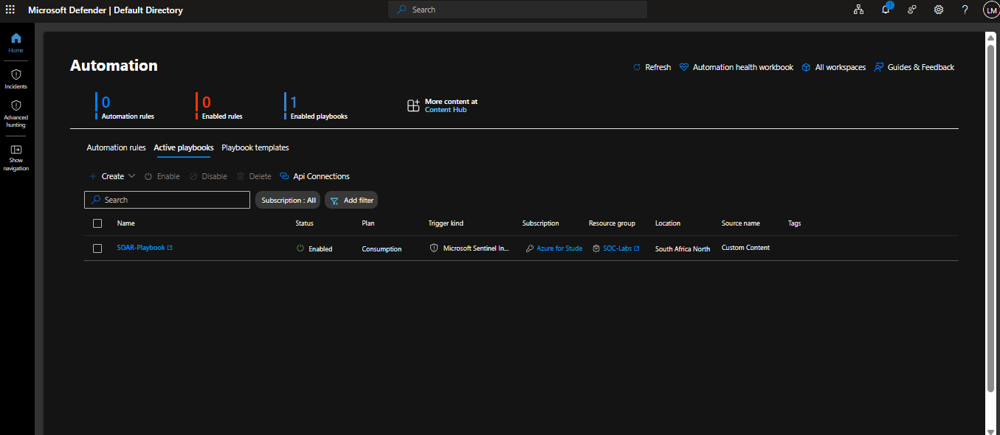

---

# 🔄 Automating Incident Response

At this stage, the Playbook was fully configured and capable of sending an email notification.

However, simply creating a Playbook does not automatically connect it to Microsoft Sentinel.

The Playbook exists as an independent Logic App until Microsoft Sentinel is instructed **when** it should be executed.

This is the role of an **Automation Rule**.

Automation Rules act as the bridge between Microsoft Sentinel and Azure Logic Apps. They continuously monitor newly created incidents and determine whether a Playbook should be executed based on conditions defined by the analyst.

This allows organizations to automate repetitive response tasks while ensuring that only relevant incidents trigger automated workflows.

---

## ⚙️ Creating the Automation Rule

To connect Microsoft Sentinel with the Logic App Playbook, I created a new **Automation Rule**.

The rule was configured to execute whenever a new security incident matching my custom Analytics Rule was created.

During configuration, I specified:

- A descriptive Automation Rule name.
- The trigger event (**When Incident is Created**).
- A condition limiting execution to incidents generated by the custom Analytics Rule.
- The action to execute the Logic App Playbook.

Using conditions is an important best practice because it prevents every incident within Microsoft Sentinel from launching the same Playbook.

Instead, automation can be targeted toward specific attack scenarios, allowing organizations to create multiple response workflows for different types of security incidents.


---

## ✅ Automation Rule Enabled

After reviewing the configuration, the Automation Rule was successfully created and enabled.

From this point onward, Microsoft Sentinel continuously monitors incoming incidents.

Whenever a new incident satisfies the configured conditions, Microsoft Sentinel automatically launches the associated Logic App Playbook without requiring any manual intervention.

This completes the connection between detection and response.

Instead of waiting for a SOC analyst to notice a new incident, Microsoft Sentinel immediately begins executing the predefined response workflow.

This demonstrates one of the primary advantages of SOAR—reducing response times through automation.

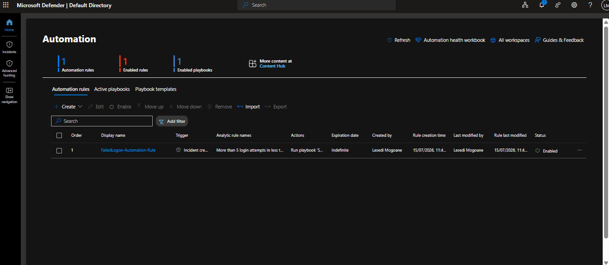

---

# 🧪 Testing the Automated Workflow

With the Analytics Rule, Playbook, and Automation Rule all configured, the final step was to verify that the complete workflow functioned as expected.

To perform the test, I generated another series of failed Remote Desktop authentication attempts against the honeypot virtual machine using invalid credentials.

At approximately the same time, additional failed authentication attempts originating from external internet scanners were also recorded against the virtual machine.

These authentication attempts were collected by the Azure Monitor Agent, forwarded to the Log Analytics Workspace, and analyzed by Microsoft Sentinel.

Once the number of failed logon events exceeded the threshold configured within the Analytics Rule, Microsoft Sentinel automatically generated a new security incident.

Unlike previous testing performed during the SIEM implementation, this incident now triggered an automated response workflow without requiring any manual action.

This demonstrates the complete transition from passive monitoring to automated incident response.

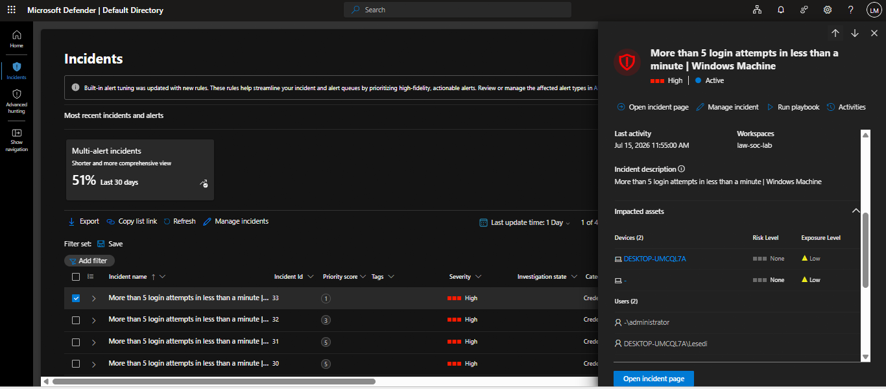

---

## 🔍 Understanding What Happened

Although only a few seconds passed, several Azure services worked together behind the scenes to complete the automated response process.

The workflow followed these steps:

1. Multiple failed RDP authentication attempts were recorded by Windows.
2. Azure Monitor Agent forwarded the Security Events to the Log Analytics Workspace.
3. Microsoft Sentinel analyzed the incoming logs using the configured Analytics Rule.
4. The Analytics Rule detected suspicious authentication activity.
5. Microsoft Sentinel created a new security incident.
6. The Automation Rule detected the newly created incident.
7. The Automation Rule launched the Logic App Playbook.
8. The Logic App executed the configured email notification.

All of these actions occurred automatically without requiring a SOC analyst to manually monitor the environment.

This demonstrates how SIEM and SOAR technologies complement one another.

While the SIEM component is responsible for collecting, analyzing, and detecting suspicious activity, the SOAR component immediately responds by executing predefined workflows.

Instead of simply identifying an attack, the environment is now capable of reacting to it automatically.

---

# ✅ Validating the Automated Response

Successfully creating the Analytics Rule, Automation Rule, and Logic App Playbook was only part of the objective.

To demonstrate that the entire SOAR workflow was functioning correctly, it was necessary to verify that Microsoft Sentinel had successfully executed the Playbook after creating a security incident.

Azure Logic Apps records the execution history of every Playbook, providing detailed information about each workflow run.

By reviewing the Run History, it is possible to confirm:

- Whether the Playbook was triggered.
- When the Playbook executed.
- Whether each step completed successfully.
- If any errors occurred during execution.

This provides valuable troubleshooting information while also confirming that the automation workflow performed exactly as expected.

---

## 📈 Reviewing the Playbook Run History

After generating another security incident, I opened the Logic App **Run History**.

The Run History showed a successful execution of the Playbook immediately after Microsoft Sentinel created the incident.

The successful run confirms that:

- Microsoft Sentinel detected the suspicious activity.
- The Automation Rule launched the Playbook.
- Azure Logic Apps executed the workflow successfully.
- The configured response action completed without errors.

This provides clear evidence that the automated response process is functioning correctly.

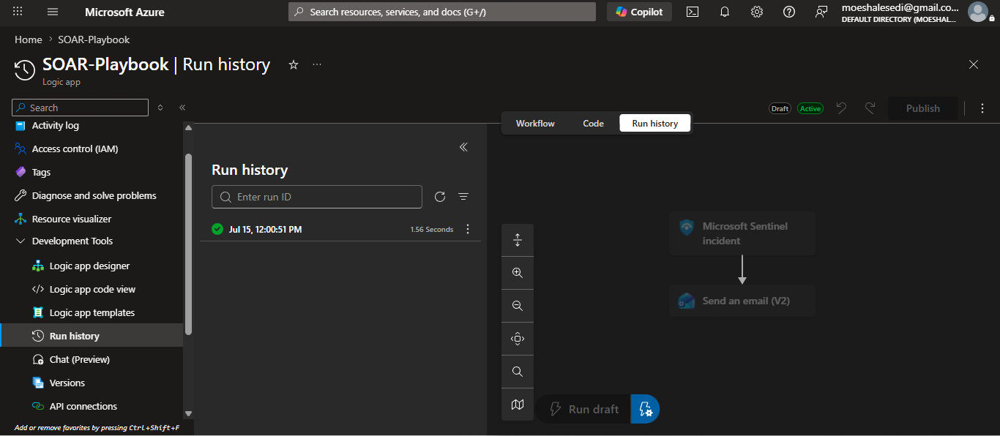

---

## 📧 Verifying the Email Notification

The final stage of the workflow was confirming that the email notification had been successfully delivered.

Shortly after the Playbook executed, an email was received from the configured Outlook account.

Receiving the email confirmed that the entire response workflow had completed successfully.

Unlike manually monitoring Microsoft Sentinel for new incidents, the Playbook automatically notified the SOC analyst as soon as suspicious authentication activity was detected.

Although this project uses a simple email notification, the same workflow could easily be extended to notify security teams through Microsoft Teams, create ServiceNow tickets, enrich incidents with threat intelligence, or perform automated containment actions.

This demonstrates how Microsoft Sentinel can significantly reduce the time between threat detection and analyst awareness.

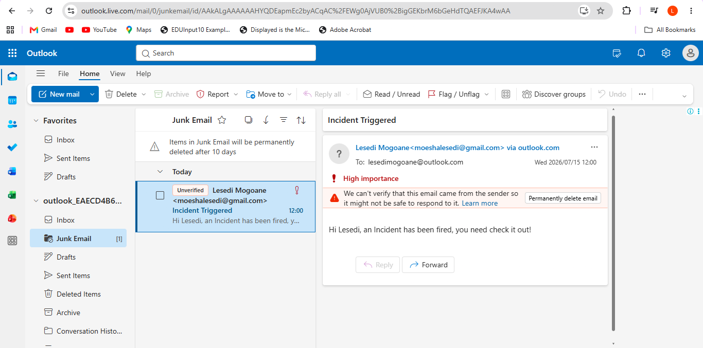

---

# 🔄 End-to-End Security Workflow

At the completion of this project, the environment was capable of automatically detecting and responding to suspicious authentication activity.

The following workflow summarizes the complete security process implemented throughout both the SIEM and SOAR phases of this project.

```text
Internet
      │
      ▼
Failed RDP Login Attempts
      │
      ▼
Windows Server Honeypot
      │
      ▼
Windows Security Events
      │
      ▼
Azure Monitor Agent (AMA)
      │
      ▼
Log Analytics Workspace
      │
      ▼
Microsoft Sentinel
      │
Analytics Rule Detection
      │
      ▼
Security Incident Created
      │
      ▼
Automation Rule
      │
      ▼
Logic App Playbook
      │
      ▼
Send Email (Outlook V2)
      │
      ▼
SOC Analyst Notification
```

Rather than simply collecting logs and displaying alerts, the environment is now capable of automatically responding whenever suspicious activity is detected.

This represents the complete lifecycle of a modern cloud-based Security Operations Center workflow—from log collection and threat detection to automated incident response.

---

# 💡 What I Learned

Before completing this phase of the project, I understood Microsoft Sentinel primarily as a platform for collecting logs and investigating security events.

Building the SOAR environment helped me understand that detection is only one part of the incident response process.

I learned how Microsoft Sentinel works together with Azure Logic Apps to automate repetitive security tasks, reducing the time between detection and response.

One of the most valuable lessons from this project was understanding how each Azure service contributes to the overall workflow.

Rather than viewing Analytics Rules, Incidents, Automation Rules, and Playbooks as separate features, I now understand how they work together to create an automated response pipeline.

I also gained practical experience configuring Logic Apps, creating Automation Rules, and validating automated workflows through Playbook Run History.

This project reinforced the importance of automation within modern Security Operations Centers, where reducing response time can significantly improve an organization's ability to investigate and respond to security incidents.

---

# 🏁 Conclusion

In this phase of the project, Microsoft Sentinel was extended beyond traditional Security Information and Event Management (SIEM) capabilities by implementing Security Orchestration, Automation, and Response (SOAR).

A custom Analytics Rule detected repeated failed Remote Desktop authentication attempts and automatically generated a Microsoft Sentinel incident.

An Automation Rule was then configured to monitor newly created incidents and launch an Azure Logic App Playbook whenever the specified detection criteria were met.

The Playbook successfully executed an automated email notification, demonstrating how Microsoft Sentinel can orchestrate response actions without requiring manual analyst intervention.

Together with the SIEM implementation completed in Part 1, this project demonstrates the complete lifecycle of a modern cloud-native Security Operations Center—from collecting Windows Security Events and detecting suspicious activity to automatically responding through Microsoft Sentinel SOAR.

While the automation implemented in this lab focused on email notification, the same architecture can be extended to perform more advanced response actions such as threat intelligence enrichment, endpoint isolation, user account remediation, and integration with external security platforms.

This project provided practical experience implementing Microsoft Sentinel SIEM and SOAR capabilities using Microsoft Azure, Azure Monitor, Log Analytics Workspace, Analytics Rules, Automation Rules, Azure Logic Apps, and Outlook integration.

---

➡️ **Return to the main project:** [Azure SIEM & SOAR Lab](../README.md)

➡️ **View the complete SIEM + SOAR Architecture:** [Combined Architecture](../Architecture/SIEM-SOAR-Architecture.png)
