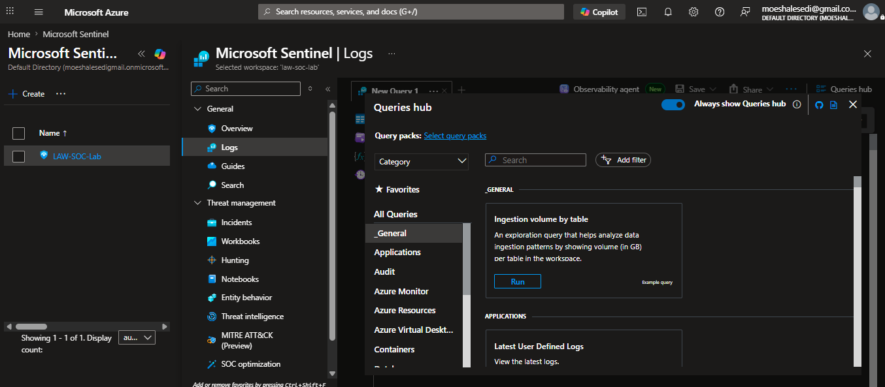

# 🛡️Azure Sentinel Honeypot - Attack Detection and Investigation Lab

## 📖 Overview

> A hands-on cybersecurity project demonstrating how Microsoft Sentinel can be used to collect, investigate, enrich, and visualize real-world attack activity against an internet-facing Windows virtual machine.

---
As I continue developing my skills in Security Operations (SOC), I wanted to build a project that goes beyond theory and demonstrates how a Security Information and Event Management (SIEM) platform works in a real environment.

For this lab, I deployed a Windows Server virtual machine in Microsoft Azure and intentionally exposed it to the public internet to act as a **honeypot**.

Using **Microsoft Sentinel**, I collected Windows Security Events generated by the virtual machine, investigated failed authentication attempts using **Kusto Query Language (KQL)**, enriched attacker IP addresses with geographic information using a **GeoIP Watchlist**, and finally visualized attack activity through an interactive Microsoft Sentinel Workbook.

Rather than simply following a deployment guide, this project focuses on understanding how security data flows from a Windows machine into Microsoft Sentinel and how that data can be used to investigate suspicious activity.

---

# 🎯 Project Objectives

The main goals of this project were to:

- Build a cloud-based SOC lab using Microsoft Azure.
- Deploy an internet-facing Windows honeypot.
- Configure Microsoft Sentinel as the SIEM platform.
- Collect Windows Security Events using the Azure Monitor Agent (AMA).
- Investigate authentication events using Kusto Query Language (KQL).
- Enrich attacker IP addresses with geographic information.
- Visualize attack activity using Microsoft Sentinel Workbooks.
- Gain practical, hands-on experience with Microsoft security technologies.

---

## 🏗️ Lab Architecture
This diagram shows how security events move from the virtual machine into Microsoft Sentinel for investigation.
```text
                           Internet
                               │
                               ▼
                     Windows Server VM
                         (Honeypot)
                               │
                  Windows Security Events
                         (Event Viewer)
                               │
                               ▼
                 Azure Monitor Agent (AMA)
                               │
                               ▼
                Log Analytics Workspace
                      (SecurityEvent)
                               │
                               ▼
                  Microsoft Sentinel (SIEM)
                               │
          KQL Queries & Threat Investigation
                               │
                               ▼
                GeoIP Watchlist Enrichment
                               │
                               ▼
             Microsoft Sentinel Workbook
```

# 📌 Project Scenario

Imagine you're a SOC analyst responsible for monitoring a Windows server that's connected to the internet.

The first question isn't **"Are we under attack?"**

It's **"What activity is happening on this machine?"**

To answer that question, security events first need to be collected, stored, and analyzed.

In this project, I built a simple SOC environment that allows exactly that.

As soon as the virtual machine was exposed to the internet, it began receiving unsolicited authentication attempts from automated scanners and bots. Microsoft Sentinel collected those events, allowing them to be investigated using KQL, enriched with geographic information, and visualized through an interactive dashboard.

---

## 🛠️ Technologies Used

| Technology | Purpose |
|------------|---------|
| Microsoft Azure | Cloud platform used to host the lab |
| Windows Server | Internet-facing honeypot |
| Azure Virtual Network | Network for the virtual machine |
| Network Security Group (NSG) | Controls inbound and outbound network traffic |
| Azure Monitor Agent (AMA) | Collects Windows Security Events |
| Log Analytics Workspace (LAW) | Stores collected logs |
| Microsoft Sentinel | SIEM platform used for monitoring and investigation |
| Kusto Query Language (KQL) | Used to query and investigate security events |
| Microsoft Sentinel Watchlists | Used for GeoIP enrichment |
| Microsoft Sentinel Workbooks | Used to visualize attack activity |

---

# 🏗️ Building the Azure Environment

Before Microsoft Sentinel could collect and analyze security events, the Azure environment first needed to be built.

This section covers the infrastructure that forms the foundation of the lab. Although the environment is relatively simple, each Azure resource plays an important role in creating a realistic SOC scenario.

---

## 📁 Creating the Resource Group

Every Azure deployment starts with a **Resource Group**.

Think of it as a container that keeps all related Azure resources together. Instead of managing each resource individually, the Resource Group allows everything to be organized in one place, making the lab easier to manage, monitor, and eventually remove when it is no longer needed.

For this project, I created a dedicated Resource Group specifically for the SOC lab.


---

## 🌐 Creating the Virtual Network

Next, I created an Azure **Virtual Network (VNet)**.

A Virtual Network works much like a private network inside Azure. It provides secure communication between Azure resources while allowing the virtual machine to receive both a private IP address for internal communication and a public IP address for internet access.

Even though this lab only uses a single virtual machine, deploying it inside its own Virtual Network reflects how cloud environments are commonly designed in production.


---

## 💻 Deploying the Honeypot

With the network in place, I deployed a **Windows Server Virtual Machine**.

Rather than hosting applications or business services, this virtual machine was created to act as a **honeypot**.

A honeypot is a system that is intentionally exposed to potential attackers so that suspicious activity can be observed and analyzed without placing production systems at risk.

Throughout this project, the virtual machine generates the Windows Security Events that Microsoft Sentinel later collects and investigates.


---

## 🔓 Intentionally Exposing the Virtual Machine

By default, Azure virtual machines are protected through Network Security Groups (NSGs). An NSG is a set of rules that allow or deny inbound and outbound traffic to resources like VMs or subnets

For this lab, I intentionally created an inbound rule named **DANGER_AllowAnyCustomAnyInbound**, which allows **all inbound network traffic** to reach the virtual machine.

Allowing unrestricted inbound traffic makes the virtual machine much more visible to internet scanners, bots, and attackers. This increases the chances of receiving real attack activity that can later be investigated inside Microsoft Sentinel.

> ⚠️ **Note:** This configuration was created only for this controlled lab. In a production environment, you’d never do that, it’s a huge security risk — it’s like leaving your front door wide open, just to see who walks in. Definitely not something you’d do at home, but perfect for this experiment.


---

# ✅ Environment Ready

At this stage, the Azure infrastructure was fully deployed.

The environment now consisted of:

- A dedicated Azure Resource Group
- A Virtual Network
- A Windows Server virtual machine acting as a honeypot
- A public IP address
- A Network Security Group intentionally allowing inbound traffic

> 💡 **Did you know?**
>
> It took less than an hour after exposing the virtual machine to the internet before automated login attempts started appearing in the Windows Security logs. This highlights how quickly internet-facing systems are discovered by automated scanners.

With the infrastructure complete, the next step was preparing the honeypot so it could begin attracting and recording security events.

# 🛠️ Bringing the Honeypot Online

With the Azure infrastructure in place, the next step was preparing the virtual machine so it could begin generating meaningful security events.

The goal wasn't simply to deploy a Windows Server—it was to create a machine that would be visible on the internet, capable of attracting connection attempts, and able to produce the Windows Security Events that Microsoft Sentinel would later analyze.

---

## 🔑 Connecting to the Virtual Machine

After the virtual machine was deployed, I connected to it using **Remote Desktop Protocol (RDP)**.

This confirmed that:

- The virtual machine was running successfully.
- The public IP address was reachable.
- Remote Desktop was functioning correctly.
- The environment was ready for the remaining configuration steps.

Successfully connecting to the server also confirmed that the Network Security Group configuration was working as expected.


---

## 🔥 Disabling Windows Defender Firewall

By default, Windows Defender Firewall blocks many types of incoming network traffic.

For this project, I temporarily disabled the Windows Firewall to make the virtual machine more visible to internet scanners and automated attack tools.

This increases the likelihood of receiving unsolicited traffic, allowing Microsoft Sentinel to capture real authentication attempts and other security events.

> ⚠️ **Important:** Disabling Windows Firewall is intentionally insecure and should never be done on production systems. It was performed only for this controlled cybersecurity lab.


---

## 🌍 Verifying Internet Connectivity

To confirm that the virtual machine could be reached from the internet, I performed a connectivity test using the server's public IP address.

Receiving successful responses confirmed that:

- The virtual machine was online.
- Network traffic could successfully reach the server.
- The honeypot was now visible to external systems.

At this point, the environment was ready to begin attracting real-world network activity.


---

## 📝 Understanding Windows Security Events

Before forwarding logs into Microsoft Sentinel, I first wanted to understand how Windows records security activity locally.

Whenever someone attempts to sign in to Windows, the operating system automatically records the event inside **Windows Event Viewer**.

These logs become extremely valuable during security investigations because they contain details such as:

- The time of the event
- The username that was used
- Whether the login succeeded or failed
- The source IP address (for network logons)
- The authentication method

Later in this project, these same events are collected by the Azure Monitor Agent and stored inside the **SecurityEvent** table in the Log Analytics Workspace.


---

## ❌ Generating a Failed Logon (Event ID 4625)

To generate a real security event, I intentionally attempted to log into the virtual machine using incorrect credentials.

Windows immediately recorded this as **Event ID 4625 – An account failed to log on.**

Failed logon events are some of the most commonly investigated events in a Security Operations Center because they can indicate:

- Incorrect passwords
- Brute-force attacks
- Password spraying
- Automated login attempts
- Unauthorized access attempts

Later in the project, these same events become the primary source of data used for threat hunting within Microsoft Sentinel.


---

## ✅ Generating a Successful Logon (Event ID 4624)

I also performed a successful login to compare the difference between successful and failed authentication events.

Windows records successful authentication using **Event ID 4624 – An account was successfully logged on.**

Having both successful and failed logon events available provides valuable context during an investigation.

For example, an analyst might investigate whether a failed login attempt was eventually followed by a successful login from the same IP address or account.

Understanding the relationship between these events helps identify suspicious authentication activity.


---

> 💡 **Why does this matter?**

Everything that happens later in this project starts here.

Microsoft Sentinel cannot investigate attacks unless Windows first records them.

The Event Viewer acts as the starting point of the investigation, capturing authentication events before they are collected by Azure Monitor and stored in the Log Analytics Workspace.

---
# 📡 Collecting Security Events with Microsoft Sentinel

At this stage, the honeypot was online and Windows was successfully recording authentication events inside Event Viewer.

However, those events were still stored locally on the virtual machine.

To investigate them using Microsoft Sentinel, they first needed to be collected and sent to Azure.

This section explains how that process works.

---

## 🗄️ Creating the Log Analytics Workspace

The first service I deployed was an **Azure Log Analytics Workspace (LAW).**

Think of the Log Analytics Workspace as a central storage location for logs.

Instead of leaving Windows Security Events on the virtual machine, Azure collects and stores them inside the Log Analytics Workspace where they can later be searched using Kusto Query Language (KQL).

Without a Log Analytics Workspace, Microsoft Sentinel would have no security data to analyze.


---

## 🛡️ Connecting Microsoft Sentinel

After creating the Log Analytics Workspace, I connected it to **Microsoft Sentinel**.

Microsoft Sentinel is Microsoft's cloud-native **Security Information and Event Management (SIEM)** platform.

Rather than storing logs itself, Sentinel uses the Log Analytics Workspace as its data source.

Once connected, Sentinel can search, investigate, visualize, and alert on the security events stored inside the workspace.



---

## 📥 Configuring the Windows Security Events Connector

The next step was enabling the **Windows Security Events via AMA** data connector.

A data connector tells Microsoft Sentinel **what type of logs should be collected**.

In this project, the connector was configured to collect Windows Security Events generated by the virtual machine.

Without enabling this connector, Windows authentication events would never reach Microsoft Sentinel.


---

## 🚀 Installing the Azure Monitor Agent (AMA)

Once the connector was configured, I installed the **Azure Monitor Agent (AMA)** on the virtual machine.

The Azure Monitor Agent acts like a courier between Windows and Azure.

Whenever Windows records a new Security Event, the Azure Monitor Agent collects it and securely sends it to the Log Analytics Workspace.

Without the Azure Monitor Agent, Windows would continue recording events locally, but Microsoft Sentinel would never see them.


---

## ✅ Verifying Log Collection

To confirm that everything was configured correctly, I queried the SecurityEvent table and verified that Windows authentication events were appearing inside Microsoft Sentinel.

Seeing these events arrive successfully confirmed that:

- Windows was generating Security Events.
- The Azure Monitor Agent was forwarding those events.
- The Log Analytics Workspace was storing them.
- Microsoft Sentinel was able to query and investigate the collected data.

With log collection successfully configured, the environment was now ready for threat hunting using Kusto Query Language (KQL).

### Verify Security Event Ingestion

Once the Azure Monitor Agent began forwarding telemetry, Kusto Query Language (KQL) was used to verify that Windows Security Events were successfully arriving in the Log Analytics Workspace.

The following query displays all Windows Security Events:


---
# 🔍 Investigating Attack Activity

With Windows Security Events successfully flowing into Microsoft Sentinel, I could begin investigating the activity being recorded against the honeypot.

The primary objective during this stage was to identify failed authentication attempts, investigate where they were coming from, and enrich the collected data to gain a better understanding of the attacks.

Kusto Query Language (KQL) was used throughout this investigation to search, filter, and analyze the collected logs.

---

## ❌ Investigating Failed Logon Attempts

One of the most common indicators of suspicious activity is repeated failed login attempts.

Windows records these events using **Event ID 4625**, making them easy to identify with KQL.

```kusto
SecurityEvent
| where EventID == 4625
```

This query returns every failed authentication attempt recorded by the virtual machine.
> ⚠️ **Note:**
>
> Earlier in this project, I examined Windows Security Events directly on the virtual machine using **Event Viewer** to understand how Windows records authentication activity.
>
> In this section, I use the **same event IDs and KQL queries**, but this time the investigation is performed against the **SecurityEvent** table in the **Log Analytics Workspace**. These are the same Windows Security Events, now collected by the Azure Monitor Agent and made available in Microsoft Sentinel for centralized analysis.
>
> This demonstrates how security events move from a single Windows machine into a SIEM, where they can be searched, investigated, and correlated using KQL.

Each event contains useful information including:

- Time of the attempt
- Username used
- Source IP address
- Authentication type
- Logon type

These details help analysts determine whether login attempts are likely to be legitimate user mistakes or malicious activity such as brute-force attacks.


---

## 🌐 Investigating Attacker IP Addresses

After identifying failed login attempts, I investigated the source IP addresses responsible for the activity.

Looking at the IP address alone can already reveal useful information, including:

- Whether multiple usernames are being targeted
- Whether one IP is generating repeated login attempts
- Whether attacks originate from the same location

To better understand one of the attackers, I copied one of the observed IP addresses and searched it using a public IP lookup service.

This provided additional information such as:

- Country
- Internet Service Provider (ISP)
- Network owner
- Autonomous System Number (ASN)

Although this information was gathered outside Microsoft Sentinel, it provided useful context during the investigation.


---

# 🌍 Adding Geographic Context

Knowing an IP address is useful.

Knowing **where it came from** is even more useful.

To enrich the authentication logs with geographic information, I downloaded a GeoIP dataset and uploaded it into Microsoft Sentinel as a **Watchlist**.

According to Microsoft, a **Watchlist** enables the collection of data from external sources so it can be correlated with events in a Microsoft Sentinel environment.

In this project, the Watchlist acts as a reference table that Microsoft Sentinel uses to match attacker IP addresses with geographic information such as:

- Country
- City
- Latitude
- Longitude

This additional context makes it much easier to understand where authentication attempts are originating and helps identify patterns during the investigation.


---

## 📋 Creating the GeoIP Watchlist

After preparing the dataset, I created a Microsoft Sentinel Watchlist named **geoip**.

This allows KQL to compare attacker IP addresses against the GeoIP database and automatically return location information.

Instead of only seeing an IP address, I could now identify the country and city associated with each attack.


---
## 📋 Verifying the GeoIP Watchlist

After creating the GeoIP Watchlist, I verified that Microsoft Sentinel had successfully imported the data.

Using the `_GetWatchlist()` function, I was able to retrieve the contents of the Watchlist and confirm that it contained the expected geographic information.

The Watchlist now included details such as:

- IP address ranges (network)
- Country
- City
- Latitude
- Longitude

This verification step confirmed that the Watchlist was ready to be used for data enrichment during the investigation.

```kusto
_GetWatchlist("geoip")
```


---

## 🧠 Enriching Security Events with KQL

Once the Watchlist had been uploaded, I used the `ipv4_lookup()` function to combine the failed authentication logs with the GeoIP dataset.

```kusto
let GeoIPDB_FULL = _GetWatchlist("geoip");

let WindowsEvents =
SecurityEvent
| where EventID == 4625
| evaluate ipv4_lookup(GeoIPDB_FULL, IpAddress, network);

WindowsEvents
| project
    TimeGenerated,
    Account,
    IpAddress,
    Country = countryname,
    City = cityname,
    Latitude = latitude,
    Longitude = longitude
```

This process is known as **data enrichment**.

Rather than replacing the original logs, enrichment adds additional context that makes investigations much more meaningful.

For example, instead of only seeing:

```
5.228.117.132
```

I could now see something like:

```
IP Address: 5.228.117.132
Country: Russia
City: Moscow
Latitude: ...
Longitude: ...
```

This makes it much easier to understand where authentication attempts are originating.


---

## 💡 What I Learned

Before completing this section, I assumed Microsoft Sentinel automatically knew where every IP address was located.

Building this lab taught me that this isn't the case.

Microsoft Sentinel only knows what exists in the logs.

To add geographic information, the logs first need to be enriched using external reference data such as a GeoIP Watchlist.

Understanding this concept helped me appreciate how security analysts combine multiple data sources to build a clearer picture during an investigation.


---

## 📚 Lessons Learned

- Learned how Microsoft Sentinel collects and analyzes security telemetry.
- Gained experience using KQL for threat investigation.
- Developed understanding of Windows authentication events.
- Practiced SOC investigation workflows.

---

## 🚀 Future Improvements

- Implement Sentinel Analytics Rules
- Create automated SOAR playbooks
- Integrate Microsoft Defender
- Simulate additional attack scenarios
- Develop custom detection rules

---

## 👨‍💻 Author

**Lesedi Mogoane**

- SC-200: Microsoft Security Operations Analyst
- SC-300: Microsoft Identity and Access Administrator
- Aspiring SOC Analyst
