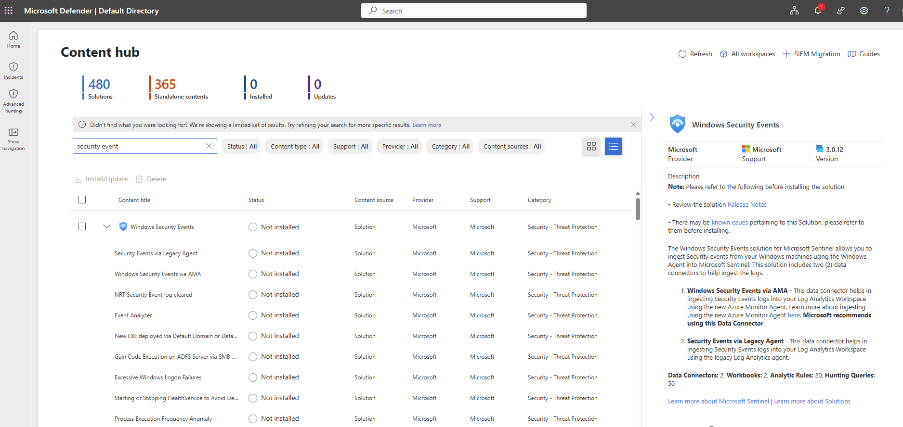

# Azure Sentinel Honeypot Attack Detection and Investigation Lab

## 📖 Overview

This project demonstrates the design and implementation of a cloud-based Security Operations Center (SOC) lab using Microsoft Azure and Microsoft Sentinel.

An internet-facing Windows virtual machine was intentionally deployed as a honeypot to attract unauthorized login attempts from the public internet. Windows Security Events generated by the virtual machine were collected through the Azure Monitor Agent (AMA), ingested into an Azure Log Analytics Workspace (LAW), and analyzed using Microsoft Sentinel.

Using Kusto Query Language (KQL), failed authentication attempts were investigated, attacker IP addresses were extracted, and geographical enrichment was performed through a custom GeoIP watchlist. Finally, a Microsoft Sentinel Workbook was created to visualize attack activity on an interactive world map.

This project demonstrates practical SOC skills including:

- Azure infrastructure deployment
- Log collection using Azure Monitor Agent (AMA)
- Centralized logging with Azure Log Analytics
- SIEM implementation using Microsoft Sentinel
- Kusto Query Language (KQL) investigation
- Threat hunting
- GeoIP enrichment
- Security data visualization using Sentinel Workbooks

The project simulates how a Security Operations Center monitors, investigates, and analyzes authentication attacks against exposed infrastructure.

---

## 🏗️ Lab Architecture

```text
Internet
    ↓
Azure Public IP
    ↓
Network Security Group (Allow RDP)
    ↓
Windows Virtual Machine (Honeypot)
    ↓
Azure Monitor Agent (AMA)
    ↓
Microsoft Sentinel (SIEM)
    ↓
KQL Investigation
    ↓
GeoIP Watchlist
    ↓
Sentinel Workbook Dashboard
```
### Data Flow

1. Attackers on the Internet attempt to authenticate to the exposed Windows virtual machine.

2. Windows records each authentication event inside the Windows Security Event Log.

3. Azure Monitor Agent (AMA) continuously collects these Windows Security Events.

4. The agent securely forwards the logs to Azure Log Analytics Workspace.

5. Microsoft Sentinel uses the Log Analytics Workspace as its data source.

6. Security analysts query the collected logs using Kusto Query Language (KQL).

7. External GeoIP data is imported as a Sentinel Watchlist to enrich attacker IP addresses with geographical information.

8. A Microsoft Sentinel Workbook visualizes attack origins on an interactive map.
---

## 🛠️ Technologies Used

| Technology | Purpose |
|------------|---------|
| Microsoft Azure | Cloud Infrastructure |
| Azure Virtual Machine | Windows Honeypot |
| Azure Virtual Network | Networking |
| Network Security Group | Traffic Filtering |
| Azure Monitor Agent (AMA) | Log Collection |
| Azure Log Analytics Workspace | Central Log Storage |
| Microsoft Sentinel | SIEM Platform |
| Kusto Query Language (KQL) | Threat Hunting |
| GeoLite2 GeoIP Database | IP Geolocation |
| Microsoft Sentinel Watchlists | Threat Enrichment |
| Sentinel Workbooks | Dashboards & Visualization |

---

## ⚙️ Environment Setup

## Create Resource Group

A dedicated Azure Resource Group was created to logically organize all resources used throughout the lab.

The Resource Group simplifies management by allowing every component of the lab to be deployed, monitored, and deleted together if required.


---


## Create Virtual Network

An Azure Virtual Network (VNet) was deployed to provide network connectivity for the Windows virtual machine.

The virtual machine receives its private IP address from this virtual network while also exposing a public IP address for internet accessibility.


---

## Deploy Windows Virtual Machine

The VM was intentionally exposed to the public internet as a honeypot to attract reconnaissance activity, automated scanning, and unauthorized authentication attempts.

Although the primary investigation focused on Windows authentication events, the network configuration allowed unrestricted inbound traffic to increase the likelihood of observing malicious activity.


---
## Configure Network Security Group

A custom inbound Network Security Group (NSG) rule named **DANGER_AllowAnyCustomAnyInbound** was created to allow **all inbound network traffic** to the virtual machine.

Unlike a production environment, where only required ports would be exposed, this lab intentionally permits all inbound traffic to maximize the likelihood of receiving unsolicited connection attempts from internet scanners and automated attack tools.

This configuration transforms the virtual machine into a more effective honeypot, allowing a wider range of network activity to be observed and analyzed within Microsoft Sentinel.

> **Note:** This configuration is intentionally insecure and should never be used in a production environment. It was implemented solely for security research and monitoring purposes.


## Disable Windows Firewall

Windows Defender Firewall was temporarily disabled on the virtual machine.

This allows inbound network traffic to reach the operating system without being blocked, increasing the likelihood of detecting internet-based reconnaissance and brute-force authentication attempts.

> **Note:** Disabling the firewall is intentionally insecure and should never be performed on production systems. It was done solely for this controlled honeypot lab.


## Verify Internet Reachability

The virtual machine was tested by sending ICMP echo requests (ping) from the host computer.

Successful replies confirmed that the virtual machine was reachable from the public internet after the firewall was disabled.

This verified that external systems would also be able to communicate with the honeypot.


## Generate Failed Login Events

To verify that Windows Security logs were being generated, an intentional failed login attempt was performed against the virtual machine.

Windows recorded the authentication failure in the Security Event Log using **Event ID 4625 (Failed Logon)**.

These events would later be collected by Azure Monitor Agent and forwarded to the Log Analytics Workspace for analysis.


---

## Generate Successful Login Events

A successful authentication was also performed to demonstrate the difference between successful and failed authentication events.

Windows records successful logons using **Event ID 4624 (Successful Logon)**.

Having both successful and failed authentication events provides useful context when investigating suspicious login activity.


---

## Configure Log Analytics Workspace

A Log Analytics Workspace (LAW) was created to centrally collect and store security telemetry from Azure resources.

The Windows virtual machine was connected to the workspace so that Windows Security Events could be ingested and queried using Kusto Query Language (KQL).

This workspace serves as the primary data source for Microsoft Sentinel.


---

## Enable Windows Security Event Collection

Windows Security Event collection was enabled within Microsoft Sentinel.

This configuration allows Windows authentication events, including successful and failed logons, to be forwarded into the Log Analytics Workspace.

Without enabling this connector, Windows Security Events would not be available for investigation.



---

## Install Azure Monitor Agent (AMA)

The Azure Monitor Agent (AMA) was installed on the virtual machine.

The agent securely collects telemetry from the operating system and sends it to Azure Monitor and the Log Analytics Workspace.

AMA replaces the legacy Log Analytics Agent and provides improved performance and flexibility.


---

## Verify Security Event Ingestion

Once the Azure Monitor Agent began forwarding telemetry, Kusto Query Language (KQL) was used to verify that Windows Security Events were successfully arriving in the Log Analytics Workspace.

The following query displays all Windows Security Events:


---

# Failed Login Query


## Investigate Failed Authentication Attempts

Failed authentication attempts were identified using Event ID **4625**.

Filtering these events allows analysts to identify brute-force attacks, password guessing attempts, and unauthorized access attempts.

The query also displays the source IP address responsible for each authentication attempt.


---
## Validate Attacker IP Address

One of the external IP addresses observed in the failed authentication logs was investigated using a public IP reputation service.

This provides additional context such as:

- Country
- Internet Service Provider (ISP)
- Organization
- ASN

Public IP enrichment helps analysts understand where suspicious activity originates before performing further investigation.


---

## Prepare GeoIP Watchlist

A GeoIP database containing public IP ranges and geographic information was downloaded.

This dataset would later be uploaded into Microsoft Sentinel as a Watchlist.

The watchlist enables KQL queries to automatically enrich authentication events with geographical information.


---
## Create Microsoft Sentinel Watchlist

The GeoIP dataset was uploaded into Microsoft Sentinel as a Watchlist.

Watchlists provide additional reference data that can be joined with log data during investigations.

In this lab, the watchlist allows source IP addresses to be mapped to geographic locations.


---
## Enrich Authentication Logs with GeoIP Data

The failed authentication logs were joined with the GeoIP Watchlist using the `ipv4_lookup()` function.

Instead of displaying only IP addresses, the query now returns additional information including:

- City
- Country
- Latitude
- Longitude

This process is known as **data enrichment**, where external intelligence is added to raw log data to improve investigations.


---

## Create Microsoft Sentinel Workbook

A custom Microsoft Sentinel Workbook was created to visualize authentication attempts.

The workbook transforms raw log data into interactive charts and maps, allowing analysts to quickly identify attack trends and geographical patterns.


---

## Visualize Global Attack Activity

The completed workbook displays failed authentication attempts on a world map.

Each point represents one or more failed login attempts originating from a specific geographic location.

Selecting a location reveals additional information including:

- Source IP address
- Country
- City
- Number of authentication attempts

This visualization provides analysts with an intuitive way to understand where attacks are originating and identify high-volume attack sources.


---

## 📚 Lessons Learned

- Learned how Microsoft Sentinel collects and analyzes security telemetry.
- Gained experience using KQL for threat investigation.
- Developed understanding of Windows authentication events.
- Practiced SOC investigation workflows.

---

## 🚀 Future Improvements

- Implement Sentinel Analytics Rules
- Create automated SOAR playbooks
- Integrate Microsoft Defender
- Simulate additional attack scenarios
- Develop custom detection rules

---

## 👨‍💻 Author

**Lesedi Mogoane**

- SC-200: Microsoft Security Operations Analyst
- SC-300: Microsoft Identity and Access Administrator
- Aspiring SOC Analyst
